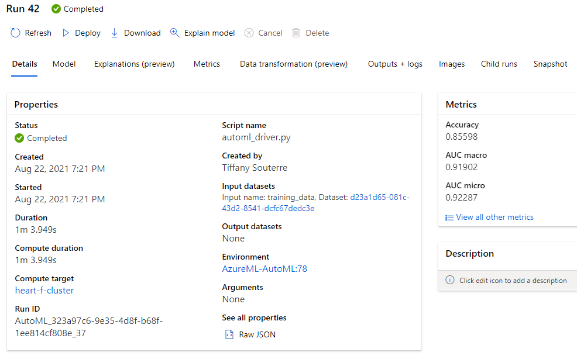
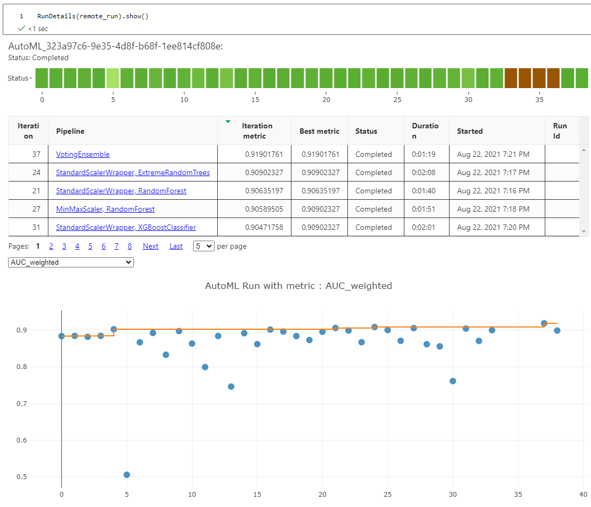
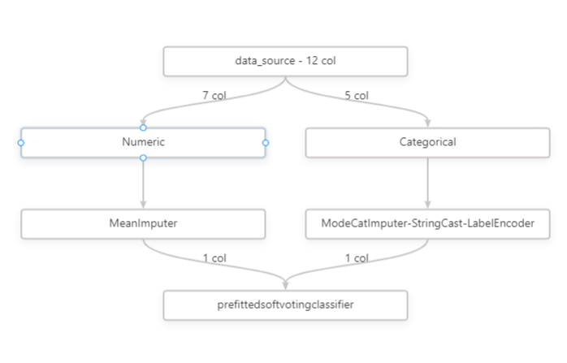
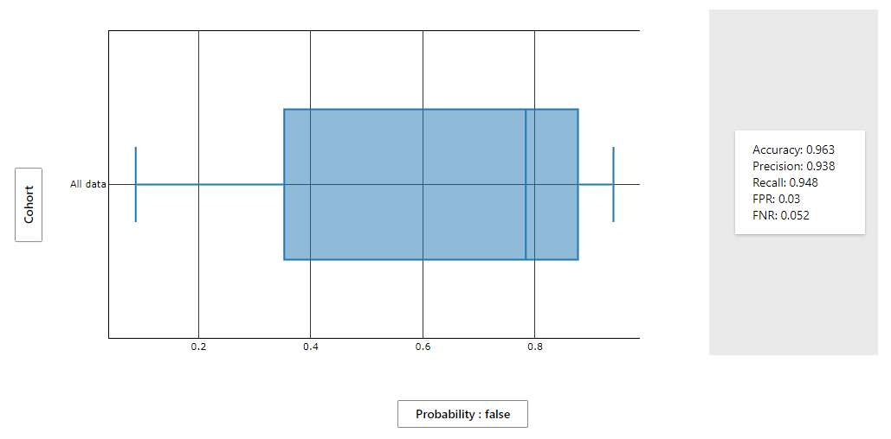
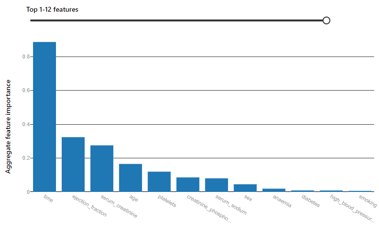
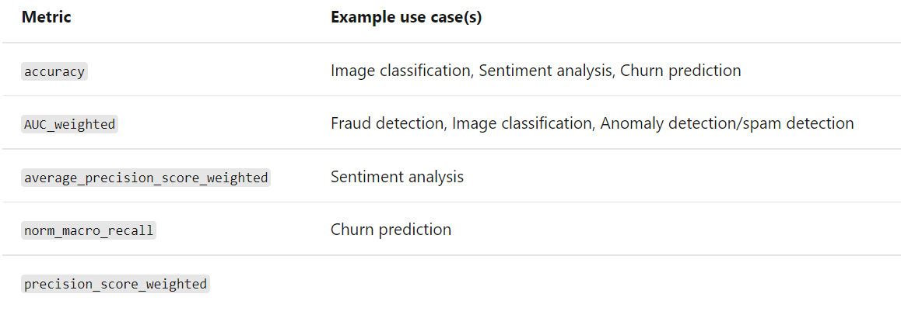
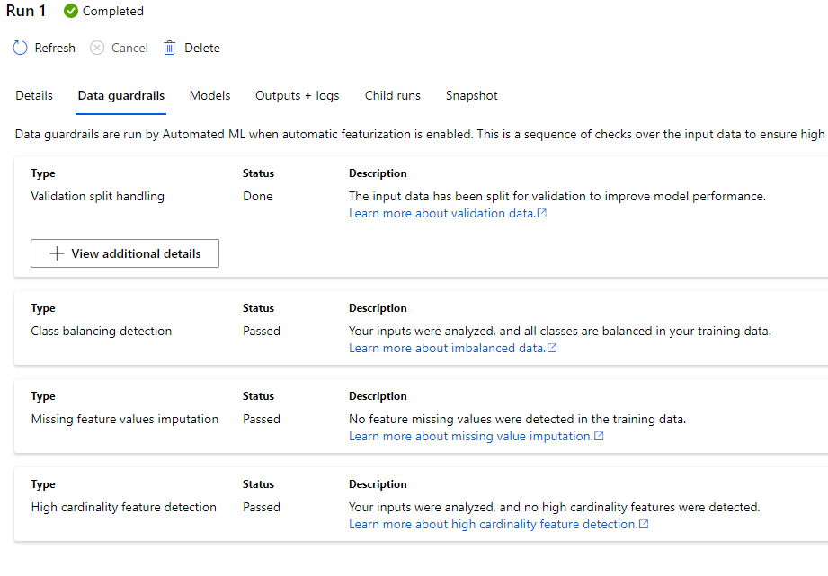
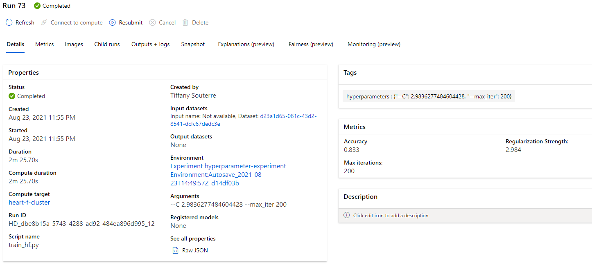
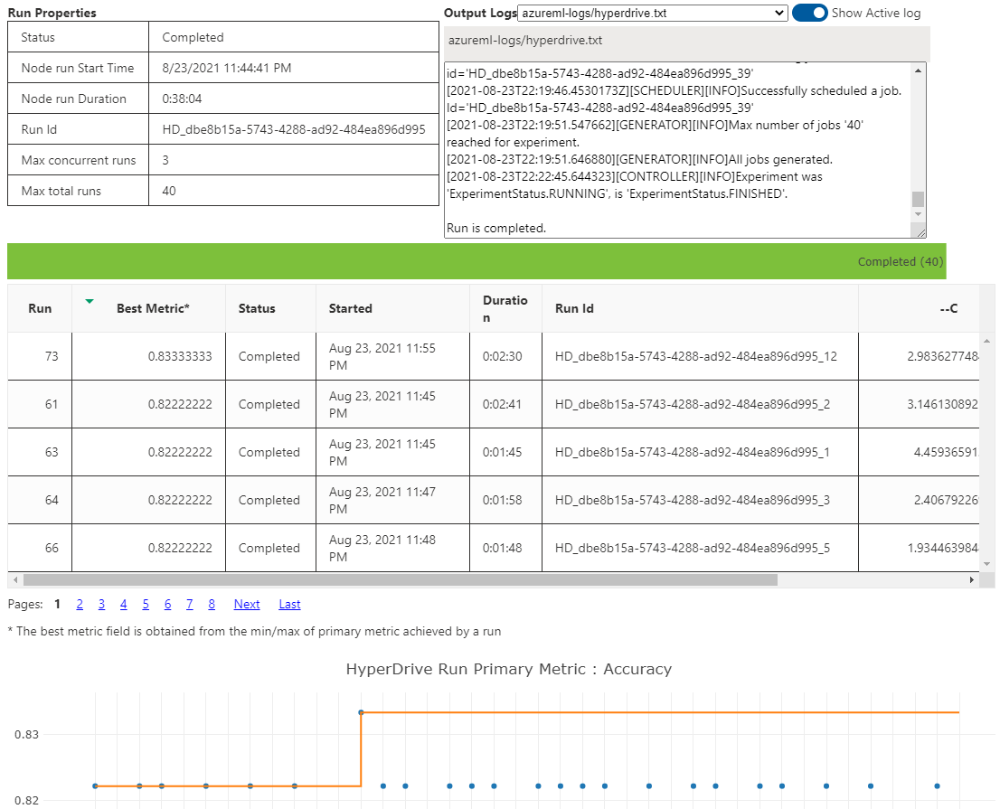

*NOTE:* This file is a template that you can use to create the README for your project. The *TODO* comments below will highlight the information you should be sure to include.
test
# Heart Failure Prediction

*TODO:* Write a short introduction to your project.
## Dataset

### Overview
I chose the dataset of [Heart Failure records from Kaggle](https://www.kaggle.com/andrewmvd/heart-failure-clinical-data) because it has a high usability score of 10 meaning that the dataset is easy to understand, machine readable, includes essential metadata and is maintained. It is also a very interesting topic. According to Kaggle, Cardiovascular diseases (CVDs) are the number 1 cause of death globally, accounting for 31% of all deaths worlwide. 

Environmental and behavioural risk factors such as tobacco use, unhealthy diet and obesity, physical inactivity and harmful use of alcohol could be used as features for estimation models. Being able to estimate the probability of developping a CVD could be of great help for high risk people.

The Dataset is tabular with 13 columns (12 features and 1 target variable) and contains 299 rows.
### Task
The task I am trying to solve is to generate a model that predicts if a person might have a heart failure or not. I will be looking at the following features:

|    | Variable name             | Type            | Description                                               | Example           |
|----|---------------------------|-----------------|-----------------------------------------------------------|-------------------|
| 1  | age                       | numerical       | age of the patient                                        | 25                |
| 2  | anaemia                   | boolean         | Decrease of red blood cells or hemoglobin                 | 0 or 1            |
| 3  | creatinine_phosphokinase  | numerical       | Level of the CPK enzyme in the blood                      | 542               |
| 4  | diabetes                  | boolean         | If the patient has diabetes                               | university.degree |
| 5  | ejection_fraction         | numerical       | Percentage of blood leaving the heart at each contraction | 45                |
| 6  | high_blood_pressure       | boolean         | If the patient has hypertension                           | 0 or 1            |
| 7  | platelets                 | numerical       | Platelets in the blood                                    | 149000            |
| 8  | serum_creatinine          | numerical       | Level of serum creatinine in the blood                    | 0.5               |
| 9  | serum_sodium              | numerical       | Level of serum sodium in the blood                        | jun               |
| 10 | sex                       | boolean         | Woman or man                                              | 0 or 1            |
| 11 | smoking                   | boolean         | If the patient smokes                                     | 285               |
| 12 | time                      | numerical       | follow-up period (days)                                   | 4                 |
|----|---------------------------|-----------------|-----------------------------------------------------------|-------------------|
| 21 | DEATH_EVENT [Target]      | boolean         | if the patient deceased during the follow-up period       | 0 or 1            |

### Access

The data were downloaded from [Heart Failure records from Kaggle](https://www.kaggle.com/andrewmvd/heart-failure-clinical-data). I then uploaded the data to Azure ML Studio in Datasets. The are several ways to access the data in the workspace. Once the data is uploaded to Azure ML, we can access it through the key we gave it. Here my dataset `key = 'heart_failure_records'`, so I can retrieve the dataset using the following command:
`dataset = ws.datasets[key] `

Once the dataset is loaded, I can use it as a pandas dataframe for further exploration.
## Automated ML
### Automl settings:
```python
automl_settings = {
    "experiment_timeout_minutes": 20,
    "max_concurrent_iterations": 5,
    "primary_metric" : 'AUC_weighted'
}
```

| Parameter | Description | Value |
|-----------|-------------|-------|
| experiment_timeout_minutes | The maximum amount of time (in minutes) that the experiment is allowed to run before it is automatically stopped and results are automatically made available. | 20 |
| max_concurrent_iterations | The maximum number of concurrent training iterations allowed for the experiment. | 5 |
| primary_metric | The primary metric used to determine the experiment's status. | AUC_weighted |

### Automl config:

```python
automl_config = AutoMLConfig(
    compute_target=compute_target,
    task='classification',
    training_data=dataset,
    label_column_name='DEATH_EVENT',
    enable_early_stopping= True,
    featurization= 'auto',
    debug_log = "automl_errors.log",
    **automl_settings
)
```
| Parameter | Description | Value |
|-----------|-------------|-------|
| compute_target | The compute instance that will run the job | compute_target |
| task | The type of task to be solved. | classification |
| training_data | The dataset to be used for training. | dataset |
| label_column_name | The name of the column containing the label. | DEATH_EVENT |
| enable_early_stopping | Enable early stopping. | True |
| featurization | The featurization method to be used. | auto |
| debug_log | The path to the log file. | automl_errors.log |

### Results
The best model was the VotingEnsemble with an AUC weighted of 92.0% and an accuracy of 85.6%.



Here is the RunDetails:



The Data transformation performed were the following:



Here is a performance chart of the best model:



Here is the aggregate feature importance:



We can see that the most important features are:
1. time
2. ejection_fraction
3. serum_creatinine

You can check the properties of the model in the properties.json file.
We have here some interesting properties about the model:
- "run_algorithm": "VotingEnsemble",
- "ensembled_iterations": "[24, 21, 27, 31, 4, 16, 20, 7, 1, 18, 15, 28]",
- "ensembled_algorithms": "['ExtremeRandomTrees', 'RandomForest', 'RandomForest', 'XGBoostClassifier', 'LightGBM', 'ExtremeRandomTrees', 'XGBoostClassifier', 'RandomForest', 'XGBoostClassifier', 'LightGBM', 'XGBoostClassifier', 'ExtremeRandomTrees']"
- "ensemble_weights": "[0.13333333333333333, 0.06666666666666667, 0.06666666666666667, 0.06666666666666667, 0.06666666666666667, 0.06666666666666667, 0.06666666666666667, 0.13333333333333333, 0.06666666666666667, 0.13333333333333333, 0.06666666666666667, 0.06666666666666667]"

The parameters of the model were:

- experiment_timeout_minutes: 20,
- max_concurrent_iterations: 3,
- primary_metric : 'AUC_weighted'
- task='classification',
- enable_early_stopping= True,
- featurization= 'auto',

I chose classification because I wanted the model to return weither if a person is likely to have heart failure or not, therefore regression and forecasting would not work. In the Classification, there are a few primary metrics we can monitor to assess the model's performance.



I chose to monitor the AUC_weighted primary metric because accuracy, average_precision_score_weighted, norm_macro_recall, and precision_score_weighted may not optimize as well for datasets which are small like in our dataset with only 299 rows.

Because we enabled the featurization, we were able to see in Data guardrails the sequence of checks that were performed over the input data. We can see that the data has a good quality to train model.



The AutoML run could also be extended with different experiment timeout to see if the performance could be improved.

## Hyperparameter Tuning
*TODO*: What kind of model did you choose for this experiment and why? Give an overview of the types of parameters and their ranges used for the hyperparameter search

I chose the ScikitLearn Logistic regression because, despite its name, it is a linear model for classification rather than regression. Logistic regression is also known in the literature as logit regression, maximum-entropy classification (MaxEnt) or the log-linear classifier. In this model, the probabilities describing the possible outcomes. It is therefore well suited for the prediction of heart failure.

I chose the following parameters:

| parameter | Description | Value |
|-----------|-------------|-------|
| C | Inverse of regularization strength; must be a positive float. Like in support vector machines, smaller values specify stronger regularization. | uniform(0.2, 5) |
| max_iter | The maximum number of iterations. | choice(100, 150, 200, 250, 300, 400) |

### Results
*TODO*: What are the results you got with your model? What were the parameters of the model? How could you have improved it?

Here is the description of the Best model:



We see an accuracy of 83.3% and the best hyperparameters are : {"--C": 2.9836277484604428, "--max_iter": 200}
The accuracy for the best model in the automl run was 85.6% which is better than the best model found with the hyperparameter tuning. Therefore I chose to deploy the autoML model.

Here is a screenshot of the `RunDetails` widget:



*TODO* Remeber to provide screenshots of the `RunDetails` widget as well as a screenshot of the best model trained with it's parameters.


To improve the model, we could try the solver parameter which is an lgorithm to use in the optimization problem. More specifically, we could try the liblinear solver which is a good choice for small dataset like ours.

We could also test other algorithms such as the `sklearn.ensemble.VotingClassifier`. The idea behind the VotingClassifier is to combine conceptually different machine learning classifiers and use a majority vote or the average predicted probabilities (soft vote) to predict the class labels. Such a classifier can be useful for a set of equally well performing model in order to balance out their individual weaknesses. 